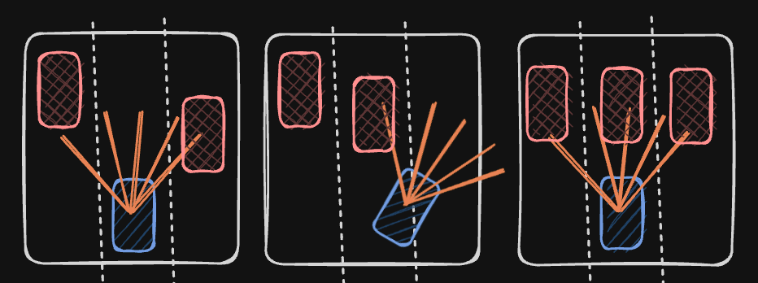
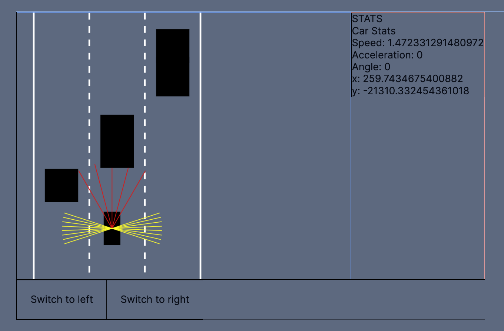
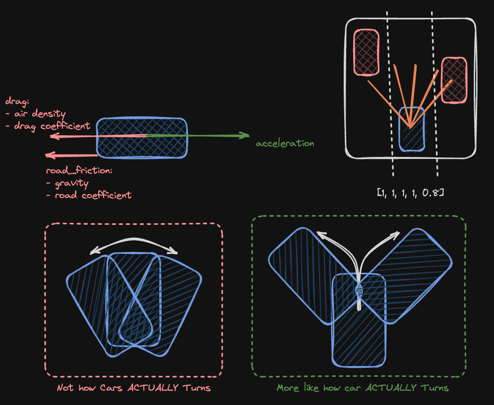

# Adaptive Cruise Control and Lane Keep Assistance Physics Model

#### Members: Teeranade Cheng (Win), Aaryan Mohta, Aarav Urgaonkar

## Table of Contents

- [Introduction](#introduction)
- [Live Demo](#live_demo)
- [Implementation](#implementation)
- [Credits](#credits)

## Introduction



The Adaptive Cruise Control (ACC) and Lane Keep Assistance (LKA) project is designed to simulate the behavior of modern vehicular control systems in a controlled environment. Our physics model aims to replicate the real-world dynamics of vehicle motion and control mechanisms, providing insights into the effectiveness of these systems in maintaining vehicle stability and safety.

## Live Demo


Experience our simulation in action by following these setup instructions:

Go ahead and `git clone` the repositiory. Run `npm install` to install any package dependencies.

```
npm run dev
```

You should now be able to see the car model on `localhost:3000`! Check out the different features we implemented.

### Implementation

#### Dynamics Calculation

Our simulation calculates vehicle dynamics such as acceleration, speed, and directional changes based on the input from the control systems (ACC and LKA). The dynamics are computed using a combination of Newtonian physics and empirical data gathered from real vehicle dynamics.

- Friction and Drag: Calculates the impact of road friction and air resistance.
- Force Application: Applies forces based on control system commands.

#### Control Systems

The ACC and LKA systems are implemented using algorithms that detect environmental variables based on rays casted to adjust the vehicle's dynamics accordingly.

- ACC: Maintains a steady speed or adjusts the speed to keep a safe distance from other vehicles.

- LKA: Keeps the vehicle within its lane boundaries by adjusting steering commands.



## Credits

This group project was built to explore the basic implementation of adaptive cruise control and lane keep assistance. We tried to simulate as close to a car physics as possible with the available time constraint that we had. In the future, there could be an integration of PID, distance calculations, 4D Imaging for sensors, etc. Nonetheless, this was another fun project where we built things straight from scratch trying to take what we learn as theory and apply it to the simulation.

Special Thanks to:

- Developer: Teeranade Cheng (Win): <a href="https://www.linkedin.com/in/teeranade-cheng/" target = "_blank">LinkedIN</a> / <a href="https://github.com/winzamark123" target="_blank">Github</a>
- Developer: Aaryan Mohta: <a href="https://www.linkedin.com/in/aaryan-mohta/" target = "_blank">LinkedIN</a> / <a href="https://github.com/aaryanmohta04" target="_blank">Github</a>
- Developer: Aarav Urgaonkar: <a href="https://www.linkedin.com/in/aaravurg/" target = "_blank">LinkedIN</a> / <a href="https://github.com/aaravurg" target="_blank">Github</a>
